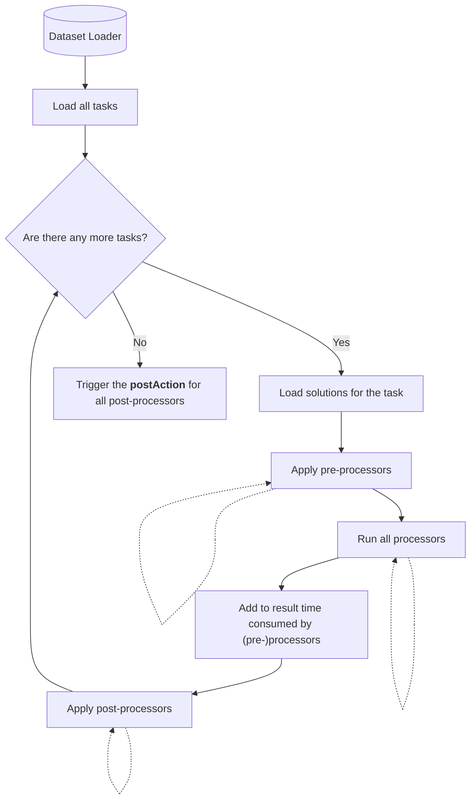

# LLM Pipeline

A pipeline for processing datasets to extract metrics

## Build/Publishing

To import the library, add PLAN maven repository:
```kotlin
repositories {
    // ...
    maven {
        url = uri("https://plan-maven.apal-research.com/")
    }
}
```
And import the library:
```kotlin
implementation("org.jetbrains.plan:experiment-runner:0.0.4")
```

## Concepts

Several concepts should be considered for extending the pipeline into your project.

### Pipeline overview



### Dataset

This project assumes that dataset should have at least two things: tasks and solutions for each task.

#### Task

The task should have at least a title.
The title is used only to determine the deterministic order of task processing.
However, the task by design could have some information that could be used in processing such as language, prompt, etc.

The task is provided to each component of the execution.

#### Solutions

The solutions of the tasks could have any type and there are no restrictions about its nature.

However, solutions are not provided to the post-processing stage.
The author uses a middleware processor to store solutions for post-processors.

### Preprocessors

The main purpose of the preprocessors is to filter the solutions before running the processors on them.
It could be a checking of solutions' validity or choosing only a random solutions.

### Processors

The purpose of the processors is to collect the metrics, based on the filtered on the previous stage solutions.

The result of the execution is stored in a type-safe map and could be retrieved in the other processors (however, that
is not recommended way,
since the processors could be parallelized and the order could be not guaranteed in the future)
or in the post-processors.

To store the result, you need to specify a key for each processor. **NB! The key should contain a unique name**.

### Postprocessors

Postprocessors are the last stage of the execution.
They made for storing the results of the processors.
For that purpose they have a `postAction` function that is triggered after all tasks are processed.

### Context

The context is used for initialization of each component before the run of the experiment.
The design allows to re-initialize the component on each run to make multiple iteration experiments are easy.

## Usage

To use the pipeline in your project, you need to specify four things:

1. `Context` — a context for the initialization
2. `Task` — extend an `AbstractTask` object with your task
3. `Solutions` — choose an information that works as an information that pipeline should process
4. `DatasetLoader<Task, Solutions>` — a way to load tasks and solutions

After it, you can proceed with implementing (pre-/post-)processors.

## Examples

There is no public available examples of using this pipeline, but feel free to write to Sergei Kharitontcev-Beglov in
Slack for any details and questions.

